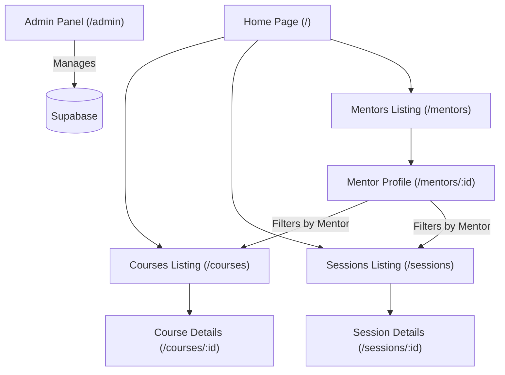

# Tutoboard Design Documentation

Tutoboard is a premium, database-driven online tutoring marketplace connecting verified expert mentors with students for structured courses, hourly 1-on-1 sessions, and interactive group classes. This document outlines the design system, architecture, page schemas, and UI components that form the platform.

---

## 1. Design System & Aesthetics

Tutoboard implements a premium, modern design aesthetic featuring high-contrast typography, harmonious color palettes, subtle animations, and consistent container styling.

### 1.1 Color Palette
The colors are managed using Tailwind CSS utility tokens and configured variables:
*   **Primary Navy (`#0f2347`)**: Used for navigation headers, footers, primary text, dark hero segments, and primary brand buttons (e.g. `bg-primary`).
*   **Secondary Blue (`#3b82f6` / `#0066cc`)**: Used for highlight links, active tab selections, primary booking CTAs, and secondary brand highlights (e.g. `bg-secondary`).
*   **Accent Amber (`#f59e0b` / `#d97706`)**: Used for rating stars, vetted checks, live tags, highlights, and secondary callouts.
*   **Surface Light (`#f8fafc` / `#f1f5f9`)**: Cool neutral slate backgrounds for section dividers and header detail panels.
*   **Border Subtle (`#e2e8f0` / `#f1f5f9`)**: Very light outlines for cards, grid items, and text input boxes to keep the interface clean and open.

### 1.2 Typography
*   **Heading Font (Outfit)**: A geometric sans-serif typeface used for headers, main slogans, large counters, and titles. It conveys confidence, structure, and quality.
*   **Body Font (Poppins)**: A friendly, highly legible geometric sans-serif used for descriptions, list items, details paragraphs, and form inputs.

### 1.3 Shapes & Curves
*   **Standard Controls (`rounded-lg`)**: Applied to text inputs, search fields, button items (including navigation header buttons like "Sign In" and "Sign Up"), and small dropdown selectors.
*   **Cards & Modals (`rounded-2xl`)**: Applied to mentor profiles, courses cards, popover menus, timing cards, and contact boxes.
*   **Tags & Badges (`rounded-full`)**: Applied to subject tags, formats, status badges, and pills.

### 1.4 Key UI Layout & Styling Guidelines
We establish and enforce the following UI patterns across all client views:
*   **Sticky Header Navigation Bar**: A fixed height of `70px` (`h-[70px] z-50 sticky top-0`) with a white background and subtle bottom border (`border-b border-border-subtle`).
*   **Page Header & Breadcrumbs Block**: A common header panel with a grey surface background (`bg-surface`) and detailed small breadcrumbs (`text-xs text-text-muted mb-3 flex items-center gap-1.5`) matching standard path patterns.
*   **Card Components**: Display grids utilizing responsive columns (3 columns on desktop, 2 on tablet, and 1 on mobile). Cards feature subtle thin borders (`border border-border-subtle`) and lift transitions on hover (`hover:shadow-lg transition-all duration-300`).
*   **Horizontal Swipers**: Testimonial slides and team cards utilize scroll snapping (`snap-x snap-mandatory overflow-x-auto`) and a hidden/thin custom scrollbar (`premium-scrollbar`) for premium look.
*   **Avatar Badges**: Circular avatars display initials using uppercase letters from the mentor name (`avatarText`) with custom color styling backgrounds (`avatarBg`) to bypass image placeholders.
*   **Toast Notifications**: Minimalist fixed pop-ups (`fixed bottom-5 right-5 z-50`) using a dark blue background container and secondary outline check accents to notify user triggers.

---

## 2. Platform Architecture & Pages

The application is built using Next.js App Router, combining Server Actions for database access with dynamic Client Components for real-time client-side sorting and filtering.

### 2.1 Core Directories & Pages

#### A. Mentors Directory (`/mentors`) & Profiles (`/mentors/[id]`)
*   **Mentors List**: Displays active verified educators in grid cards. Includes real-time query inputs and experience level sliders. All active tutors show a blue `Verified` indicator.
*   **Profile Detail**: Non-sticky, static split grid layout.
    *   **Left Column**: Biography text, academic credentials block, and interactive lists of courses and sessions they teach.
    *   **Right Column**: Overview card displaying initials avatar, rating, hourly rate, and action triggers.

#### B. Course Directory (`/courses`) & Detail (`/courses/[id]`)
*   **Course Listing**: Supports query filters for pricing, format, difficulty level, and subject.
*   **Course Details**: Displays the course overview, dynamic syllabus checklists, timing options, pricing boxes, and inclusion parameters.

#### C. Session Directory (`/sessions`) & Detail (`/sessions/[id]`)
*   **Session Listing**: Pay-per-session hourly lessons. Supports filtering by scheduling days, platforms (Zoom/Google Meet), and languages.
*   **Session Details**: Interactive schedule selector, rescheduling policy box, and zoom meeting inclusions list.

#### D. Admin Panel (`/admin`)
*   **Management Dashboard**: Provides inline editors for home hero titles, counter numbers, student testimonials, and tutor accounts. Includes advanced fields inside a slider drawer to edit inclusions lists and covered topics.

---

## 3. Database Schema Mapping

Tutoboard uses a Supabase PostgreSQL backend. Core mapped tables:

### 3.1 `mentors`
*   `id` (UUID, Primary Key)
*   `profile_id` (References `profiles.id`)
*   `expertise` (TEXT[], subjects like `["Mathematics", "Science"]`)
*   `hourly_rate` (DECIMAL)
*   `qualification` (TEXT, e.g. `B.Tech CS, Senior Engineer`)
*   `experience` (INTEGER, years of teaching)
*   `bio` (TEXT)
*   `rating` (DECIMAL, default `5.0`)
*   `is_active` (BOOLEAN)

### 3.2 `courses`
*   `id` (UUID, Primary Key)
*   `title` (TEXT)
*   `description` (TEXT)
*   `about_course` (TEXT)
*   `cover_image_url` (TEXT)
*   `subject` (TEXT)
*   `format` (TEXT, e.g. `Live batch` or `Recorded`)
*   `price` (DECIMAL)
*   `mentor_id` (References `mentors.id`)
*   `status` (TEXT, e.g. `Active`)

### 3.3 `sessions`
*   `id` (UUID, Primary Key)
*   `title` (TEXT)
*   `description` (TEXT)
*   `about_session` (TEXT)
*   `whats_covered` (TEXT[], checklists)
*   `inclusions` (TEXT[], Zoom/Meet parameter items)
*   `duration_options` (TEXT, default `'60 or 90 min'`)
*   `platform` (TEXT, default `'Zoom'`)
*   `language` (TEXT, default `'English / Hindi'`)
*   `days` (TEXT, default `'Mon - Sat'`)
*   `reschedule_policy` (TEXT, default `'Up to 4 hrs before'`)
*   `mentor_id` (References `mentors.id`)
*   `status` (TEXT, e.g. `Active`)

---

## 4. Interaction Flows

### 4.1 Mentor Course/Session Redirection Filter
When a user clicks "View all courses" or "View all sessions" on a mentor's profile page, they are redirected using URL search parameters:
1.  Redirect routes to `/courses?mentor=Rahul%20Nair`.
2.  The `/courses` page wrapper captures `mentorParam` inside `useSearchParams()`.
3.  The search state initializes to the mentor's name, filtering the listings to display only their published items.
4.  Breadcrumbs dynamically adapt to show `Home / Courses / Rahul Nair` and the page header title updates to `Explore courses by Rahul Nair`.
